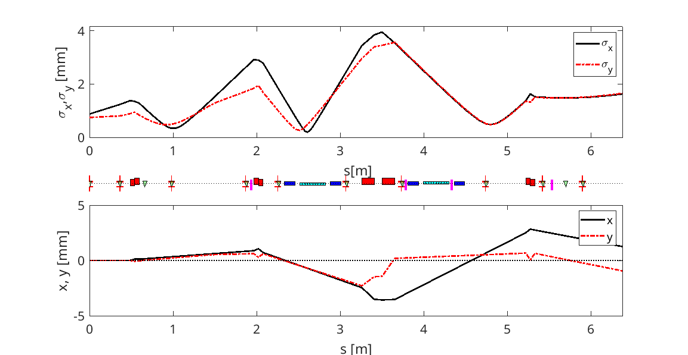

# DigitalTwinEpics
Controlling a Digital Twin of the CEBAF Injector from EPICS

* digital_twin.m: main program
* read_lattice_file: does what the name says
* do_all_plots.m: makes the figures
* make_viewer_image.m: creates the figures with viewer images
* misalign_magnets.m: shuffles the transverse magnet positions
* debug_interface.m: add interface to vary individual entries in lattice file
* add_bpm_to_epics.m:
